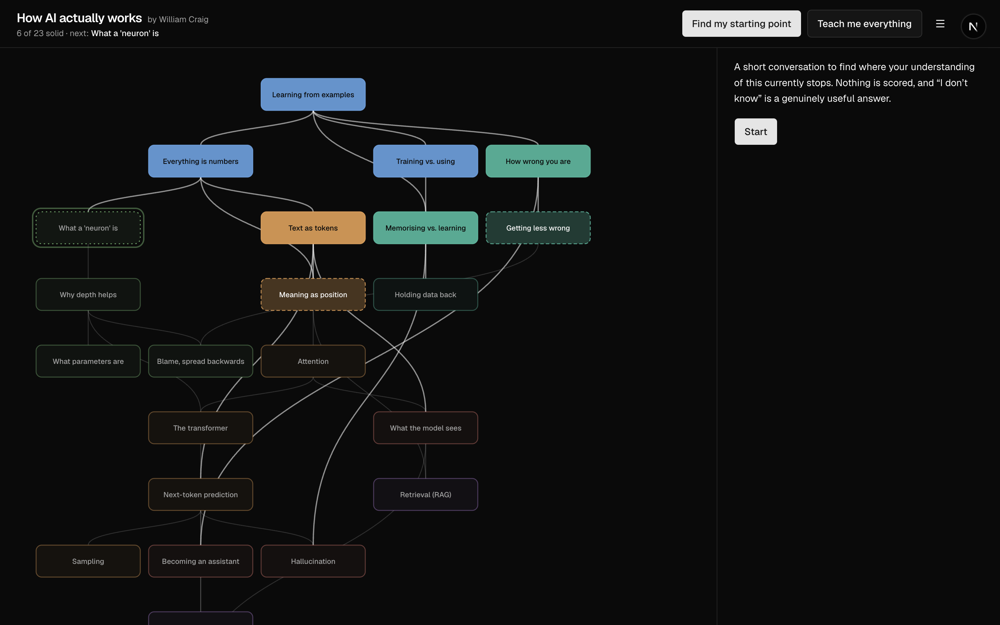
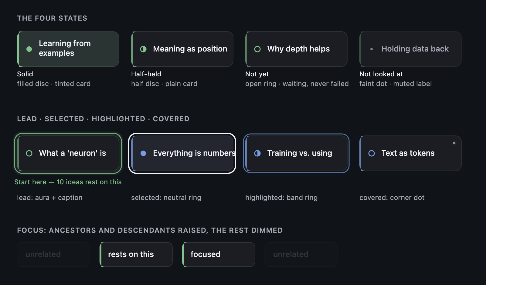

# Edgewise — visual and interaction redesign

**Status: proposal. Nothing in `src/` has been changed yet.**

Audited on 2026-09-03 against the running app, in **BrowserOS neo** (Chromium 148)
driven over the DevTools Protocol — see `docs/redesign/before/` for the captures
and "How this was measured" at the bottom for the harness.

The map's clarity outranks everything below. Where a proposal here turned out to
hurt it when actually rendered, that is said in place rather than shipped.

---

## 1. What is actually wrong

Six findings. Three are measured, three are judgements about the drawing.

### 1.1 The map's labels fail AA in light mode — measured

This is the only finding that is a defect rather than a preference, and it lands
on the most important element in the product.

`STATE_STYLE` paints the node fill as the band colour at an opacity, then puts
the label directly on it. In light mode that gives:

| State | Label colour | Contrast, worst band | AA (4.5:1) |
|---|---|---|---|
| `known` | `--background` (white) on 90% band | **2.89** | ✗ fails |
| `shaky` | `--foreground` on 28% band | 13.77 | ✓ |
| `blocked` | `--muted-foreground` on 7% band | **4.34** | ✗ fails |
| `unexplored` | `--muted-foreground` on 5% band | **4.45** | ✗ fails |

Dark mode passes everywhere (worst 5.42). So the map is legible for whoever
built it — who works in dark — and not for a light-mode visitor. `known` at
2.89:1 is the worst case, and `known` is the state the map most wants read.

The cause is structural, not a bad colour pick: **the label sits on a
hue-varying fill**, so its contrast is hostage to six different band colours
across four opacities — twenty-four combinations that all have to pass, and
seven do not. Retuning the hues cannot fix that; the label has to come off the
band colour. §3.3 does that, and the result passes at 11.60 worst in both themes.

### 1.2 State is encoded as dash pattern, at 10.5px, and cannot be decoded

Solid / dashed `5 3` / dotted `2 4` / solid-but-fainter, at 1.3px stroke width.
The difference between `blocked` (dotted `2 4` at 7% fill) and `unexplored`
(solid at 5% fill) is roughly one pixel of pattern and two percent of fill.

Nothing on screen teaches the code either. The legend below the map explains the
six *bands*; the four *states* — the thing the whole product is about — are
explained nowhere in the map's own vicinity. `STATE_COPY` already holds the
right words ("Solid", "Half-held", "Not yet", "Not looked at") and they appear
only inside the Inspector, one node at a time.

Also: the band legend is **below the whole 1050px map**, inside the map's own
scroll container. At 1440×900 you have to scroll 250px past the last node to
reach it. Nobody will.

### 1.3 The lead node reads as an error, not an invitation

`isLead` draws a dashed outline in the band colour at 45% opacity around a node
that — because the lead is by definition not `known` — is *also* drawn with a
dashed or dotted border. Two dashed rectangles nested inside each other.



In the capture above, "What a 'neuron' is" is the lead. It is the single most
important mark on the screen — the answer to "what is blocking me" — and it is
drawn in the visual language every design system reserves for *invalid* or
*placeholder*. The comment in `concept-map.tsx` is right that a label naming the
gap would be the wrong move; a halo is the right instinct. This particular halo
is not doing it.

The count that makes the map worth having — *"22 of the later ideas rest on
it"*, which `AGENTS.md` calls the single most important sentence in the product
— is computed (`downstreamOf`) and shown only in the Inspector, after a click,
as the last paragraph of body text. It is never on the map.

### 1.4 Edges are 33 curves at two opacities, and answer no question

`satisfied` (prerequisite is `known`) draws at `foreground/55`, everything else
at `foreground/15`. That is a genuinely good idea — "the solid path you are
standing on" — and at 33 edges it does not survive. Around `attention` and
`next-token-prediction` six curves cross within 40px of each other, several
passing straight through unrelated nodes' labels.

Hovering a node does nothing. Selecting a node does nothing to its edges. So the
two questions a prerequisite graph exists to answer — *what does this rest on*,
*what rests on this* — are answerable only by tracing curves with a finger.

### 1.5 The conversation panel is mostly nothing


Idle: three lines of 14px text, one button, then ~640px of empty panel. Running:
turns are `<p>` elements 16px apart, tutor and learner distinguished only by a
grey background chip and a 24px indent. The tutor's turns are the emotional
centre of the product and are set in the same 14px UI face as a button label.

The composer has no surface of its own, so at rest the panel has no visual
bottom edge — which also means the voice halo, which lights the *panel's* edge,
has nothing legible to come off at the composer end.

"I don't know" — which the README calls the most useful answer you can give — is
`variant="ghost"`, the same treatment as "Stop reading". It is styled as the
least important control on the row.

### 1.6 Small screens are a fallback, not a layout

Measured, 390×844 (`docs/redesign/before/before-map-progress-390-dark.png`):

- The header alone is **330px**, 39% of the viewport, because two long-labelled
  buttons plus a menu and a theme toggle wrap onto three rows.
- The map's `minWidth: 760` overflows a 390px viewport by 370px. The root node
  is off the right edge; you land on a map whose top is not visible.
- The panel and the map split one non-scrolling viewport between them, so both
  get roughly 250px.

At 820 the DOM-order rule does its job (you land on the panel), but the map
below it gets 530px and no indication it is there.

Two things in the current build are **right and are kept**: `h-dvh` +
`overflow-hidden` (page scroll measured at 0 at every size tested), and panel
first in the DOM.

---

## 2. Direction

A quiet, editorial, tactile instrument. The map should read as a printed diagram
that happens to be alive: restrained colour, real surfaces, one strong accent
system, motion that only ever explains a change.

Three rules the whole thing is judged against:

1. **State is never colour-only.** Every state carries a distinct glyph shape,
   readable in greyscale and at 100% zoom.
2. **Colour groups, it does not grade.** The six band hues say *which part of the
   subject*; they never say *how you did*. Red is reserved for nothing.
3. **Nothing moves unless something changed.** The lead-node aura and the voice
   halo are the only loops.

---

## 3. The system

### 3.1 Surfaces and colour

Replacing pure `oklch(1 0 0)` / `oklch(0.145 0 0)` with tonal near-neutrals —
cool on dark, warm paper on light — and adding a three-level surface scale.

```css
/* dark */                          /* light */
--surface-0: oklch(0.155 0.012 265) --surface-0: oklch(0.981 0.005 85)   /* app ground */
--surface-1: oklch(0.188 0.013 265) --surface-1: oklch(0.995 0.003 85)   /* map pane, panel */
--surface-2: oklch(0.232 0.014 265) --surface-2: oklch(0.965 0.006 85)   /* node cards, composer */
--foreground: oklch(0.968 0.006 265) --foreground: oklch(0.205 0.014 265)
--muted-foreground: oklch(0.735 0.016 265) / oklch(0.505 0.014 265)
```

`--surface-raised` = `--surface-2` plus `inset 0 1px 0 oklch(1 0 0 / 6%)` on
dark and a real shadow on light. Used by the composer, the tools menu, the
dialogs, and the selected node.

Verified (`docs/redesign/contrast.mjs`, run in §7):

| | dark | light |
|---|---|---|
| foreground on surface-2 | 15.32 | 16.19 |
| muted on surface-2 | 7.16 | 5.31 |
| muted on surface-1 | 7.89 | 5.79 |

**Band hues**, retuned for the new bases. Still six, still the only strong colour
in the product, still three of them build the halo.

| Band | now | proposed | why |
|---|---|---|---|
| foundations | 250 | 258 | — |
| learning | 175 | 196 | pulled off `networks` |
| networks | 145 | 152 | — |
| language | 65 | 78 | — |
| behaviour | **25** | **38**, lower chroma | see below |
| systems | 310 | 300 | — |

`behaviour` at hue 25 renders as a saturated red-pink — in the light capture,
"Hallucination" and "What the model sees" read as error rows in a table. That
directly contradicts the product's own rule that red is reserved for nothing.
Moving it to 38 at reduced chroma gives terracotta: still clearly the warm band,
no longer alarm. It cannot be confused with a real error either, since the only
red in the build is `--destructive` at chroma 0.24, nearly twice as saturated.

Band contrast as a graphic against the node card: **worst 6.11 dark, 3.86 light**
(3:1 required). Full per-band table in the script output.

Bands are not colour-blind-separable at six hues and are not asked to be: they
group, the glyph carries state, and every node is labelled.

### 3.2 Type

Geist stays for UI. A display face joins it for headings and for the tutor's
voice: **Newsreader** (`next/font/google`, variable, optical sizing, 200–800 +
italic). Reasons: it is a text serif rather than a display serif, so it holds up
at 17–19px where the tutor's turns live; it has a real italic for asides; and
being spoken to in a serif reads differently from being messaged in a UI face,
which is the distinction the conversation panel currently fails to make.

Self-hosted by `next/font`, so `font-src 'self'` in the CSP covers it with no
change.

```css
--text-2xs:  0.6875rem/1.45  +0.02em   /* legend, node captions */
--text-xs:   0.75rem/1.5     +0.01em   /* meta, counters */
--text-sm:   0.8125rem/1.6    0        /* secondary UI */
--text-base: 0.875rem/1.65    0        /* UI body */
--text-read: 1.0625rem/1.65  -0.003em  /* Newsreader — tutor prose */
--text-lg:   1.125rem/1.35   -0.011em
--text-xl:   1.375rem/1.3    -0.014em
--text-2xl:  1.75rem/1.22    -0.018em
--text-3xl:  2.25rem/1.15    -0.02em
```

No ad-hoc sizes. `font-variant-numeric: tabular-nums` on every counter
("6 of 23", "5 of 23", the walk position).

Map labels move from **10.5px to 13px**, wrapped to at most two lines by a pure
`wrapLabel()` with tests. At the map's default desktop zoom (fit-to-width, §3.4)
that renders at 13px — above the 12px floor with room to spare.

### 3.3 The node



`docs/redesign/node-spec.svg` is the source. 168×58, `rx` 10.

- **Card**: opaque `--surface-2` with a hairline border. Always. This is the fix
  for §1.1 — the label sits on a known neutral, never on a band colour.
- **Accent**: a 3px band-coloured bar down the leading edge, at an opacity that
  varies with state (1.0 / 0.75 / 0.55 / 0.30). Carries "which part of the
  subject" without touching legibility.
- **Glyph** at x=20, vertically centred — the state, as a shape:

  | State | Glyph | Card |
  |---|---|---|
  | `known` | filled disc | tinted with the band at 14% (dark) / 11% (light) |
  | `shaky` | half disc | plain |
  | `blocked` | open ring | plain |
  | `unexplored` | 2px faint dot | plain, border at 50%, label muted |

  Filled → half → outline → dot is a progression that survives greyscale,
  deuteranopia, and a 60% zoom-out. `blocked` is an *open ring*, which reads as
  waiting; nothing about it reads as failed.
- **Label** at x=36, 13px/500, `--foreground` (muted only for `unexplored`), up
  to two wrapped lines.
- **Covered** (walked through): a 2.2px muted dot in the top-right corner, as far
  from the state glyph as the card allows. Still a fifth mark and not a fifth
  colour — "has been explained to you" stays a different axis, per `AGENTS.md`.

Three distinct emphasis states, as required:

- **Lead** — a band-coloured aura (a 10% fill plus a 1.5px solid ring, breathing
  once every 3.6s) *and a caption underneath*: **"Start here — 22 ideas rest on
  this"**, computed from `downstreamOf`. This puts the product's most important
  sentence on the map instead of three clicks away, and it names the structure
  rather than the person. Solid ring, never dashed.
- **Selected** — a crisp 2px neutral ring and a lift to `--surface-raised`.
  "You opened this."
- **Highlighted** (the node the conversation or the walk is on) — a 1.5px band
  ring, no aura, no lift.

### 3.4 Edges, focus, and the map surface

- Satisfied edges at `foreground/50` and 1.8px with round caps; unsatisfied at
  `foreground/16` and 1.2px. Curvature tweaked so a curve leaves and arrives on
  the vertical, clearing intermediate labels.
- **Focus** (hover, keyboard focus, or selection): compute `ancestorsOf` and
  `descendantsOf` — pure, tested — raise those nodes and the edges between them
  to full opacity, dim everything else to 0.22 over `--dur` 180ms. This is the
  answer to §1.4 and the reason the graph is drawn at all.
- **Band rail** rather than background regions: a 4px column at the map's left
  edge, segmented by band, labelled on hover. Full-area band tints were tried in
  the mock and added noise behind the edges; the rail is being built, and if it
  reads as chrome rather than as structure it goes and the legend carries the
  bands alone.
- **Pan and zoom** on `viewBox`: wheel/pinch zoom clamped to 0.5–2.5, drag to
  pan, `Fit` button, and keyboard — arrows move between nodes by layer/row,
  Enter opens, Esc closes. Default zoom is **fit-to-width** on desktop (the map
  is 928×1050 against a 928px pane, so 1:1, with 260px of vertical scroll inside
  the pane — the same irreducible amount the current build measured) and
  **fit-all** on phone, which is what fixes §1.6's 370px overflow. Zoom maths is
  pure and tested. Without JS or under `prefers-reduced-motion`, the current
  shrink-to-floor-then-scroll behaviour is what remains.
- **Legend**: replaces the dot row. The four states drawn exactly as the map
  draws them, each with its `STATE_COPY` word — an inline teaching legend, above
  the map, outside its scroll container. Bands move into a compact popover off
  the rail.
- **First visit**: no ghost-box field. A quiet caption by the root node, and a
  reveal staggered 30ms per layer, once per session, skipped under reduced
  motion.

### 3.5 Motion

```css
--dur-fast: 120ms;  --dur: 180ms;  --dur-slow: 320ms;  --dur-reveal: 500ms;
--ease: cubic-bezier(0.22, 1, 0.36, 1);
```

`motion` spring for layout only: `{ stiffness: 420, damping: 38, mass: 0.9 }` —
critically damped, no overshoot. Nothing bounces. The only loops are the voice
halo's breathe and the lead node's aura.

State change (explain-back clears a block, or a hand mark): glyph morphs, one
soft band-coloured pulse at 500ms, and any edge that just became satisfied draws
in via `stroke-dashoffset` on the existing `edgewise-draw` keyframe.

Mode switches (session ↔ walkthrough ↔ inspector) crossfade via `motion`'s
`AnimatePresence`, **not** the View Transitions API. Reason, checked against
`node_modules/next/dist/docs/01-app/02-guides/view-transitions.md`: React's
`<ViewTransition>` only activates on Transitions, Suspense, or
`useDeferredValue` — "Regular `setState` calls do not trigger them". Edgewise is
one route whose modes are `useState` on a client component, so every switch
would need wrapping in `startTransition` to animate at all, and the
`::view-transition` overlay would sit over the voice halo and the map's pointer
handling for the duration. `AnimatePresence` gets the same crossfade without
either.

Every animation extends the existing `prefers-reduced-motion` block rather than
forking it.

### 3.6 Shell, panel, responsive

- **Header**: slim, sticky, `backdrop-filter`, hairline bottom. Subject as a
  wordmark, byline muted. The two modes become a segmented control with a
  `layoutId` indicator. Tools becomes a base-ui `Menu` with real keyboard
  support (it is a bare `div` today). Theme toggle stays where it is.
- **Progress**: "6 of 23 solid · next: …" is currently 12px muted text and is the
  most important line on the page. It becomes a component — a segmented ring in
  band colours, the count in tabular figures, the lead node named. No
  percentage, no score. Header on desktop; panel on phone.
- **Panel as a reading surface**: tutor turns in Newsreader at `--text-read` on a
  ~60ch measure, learner turns in Geist, visibly lighter, no bubbles. New turns
  use `edgewise-rise`. Composer in a `--surface-raised` block pinned to the
  bottom, "I don't know" promoted to a proper secondary action with encouraging
  copy, thinking state as a restrained inline mark in the display face. The
  Chrome-sends-audio-to-Google disclosure moves from permanent body text into an
  `Info` popover beside the mic — it stays before the microphone opens, it stops
  being furniture.
- **Walkthrough**: the `simplificationCost` block becomes a labelled aside —
  "What this simplification gets wrong" — in a muted band tone, since the README
  calls that field a ladder.
- **Explain-back**: the verdict reveal gets a short transition into the new
  state, and the map's pulse fires in sync with it.
- **Breakpoints**: ≥1280 map left / panel right as now. 768–1279 the panel
  becomes a drag-handled bottom sheet over a full-width map, two snap points
  (peek / half). Phone: panel is primary, map behind a full-screen "Map" toggle
  with pan/zoom. Panel stays first in the DOM. The page still never scrolls.

---

## 4. Invariants, and how each will be verified

| # | Invariant | Verification |
|---|---|---|
| 1 | `content/graph.json` untouched | `git diff --exit-code content/graph.json` |
| 2 | No force layout, no graph library, plain SVG | `git diff package.json`; positions still from `layer`/`row` |
| 3 | Four states, no score, no percentage, no red | palette script asserts no token within 30° of hue 25 above chroma 0.16 |
| 4 | Being taught never moves the map | existing `walkthrough` tests; no new write path from `stepFor` |
| 5 | Explanations withheld mid-session | `reveal` logic untouched; asserted in a component test |
| 6 | Facilitator keys 1–4 and `f` | preserved exactly; `f` is currently **unimplemented** — see §6 |
| 7 | Hands-free voice; halo answers "can it hear me" | halo CSS carried over verbatim; manual check in BrowserOS neo |
| 8 | Comments explaining *why* are kept or rewritten true | reviewed per file in the diff |
| 9 | lint / typecheck / test / build / validate-graph | run at the end; new pure logic gets tests |

New pure logic that will get tests: `wrapLabel`, `ancestorsOf` / `descendantsOf`,
`fitScale` / `clampZoom` / `panBounds`, and the token contrast assertion.

---

## 5. Order of work

1. Tokens and type — `globals.css`, `layout.tsx`.
2. The map — node, edges, focus, lead, legend, pan/zoom, keyboard, a11y.
3. Shell — header, segmented control, responsive, bottom sheet.
4. Panel surfaces — conversation, walkthrough, inspector, explain-back,
   completion, welcome, setup.
5. Motion pass, then a reduced-motion pass.
6. Verification — re-shoot every view/theme/breakpoint, contrast script, full
   command set.

One dependency added: `motion`. One font added: Newsreader via `next/font`.

---

## 6. Two things found that are not visual, and are not mine to decide

**`f` does not hide the controls.** `AGENTS.md` documents facilitator mode as
"press `f`, then turn the screen around — `f` hides every control", and calls it
the mitigation for the largest risk in the product. `src/app/page.tsx`'s `onKey`
handles `Escape` and the digits `1`–`4`. There is no `f` branch anywhere in
`src/`. So the gate in step 3 cannot currently be run as written.

I am treating this as **in scope**: invariant 6 says preserve facilitator mode
exactly, and the redesign touches every control it would have to hide, so
building it now is cheaper than building it after. Say if you would rather it
stayed out.

**The Setup dialog is not focus-trapped**, and neither is Welcome. Both are
`role="dialog" aria-modal="true"` on a plain `div`, so a screen reader is told
the rest of the page is inert while Tab happily walks into it. Converting both
to base-ui `Dialog` is already in the plan; flagging that it is a correctness
fix, not a restyle.

---

## 7. How this was measured

The app ran on `localhost:3000`. Screenshots came from **BrowserOS neo**
(`/Applications/BrowserOS neo.app`, Chromium 148) launched against a scratch
profile with `--remote-debugging-port=9222` and driven over the DevTools
Protocol from a ~90-line client — `Emulation.setDeviceMetricsOverride` for exact
viewports and `prefers-color-scheme`, `Runtime.evaluate` to seed `localStorage`
and drive controls, `Page.captureScreenshot` to capture. 36 captures: 6 views ×
3 widths (390 / 820 / 1440) × 2 themes.

Contrast numbers come from `docs/redesign/contrast.mjs`, which converts the
oklch tokens to sRGB itself, composites each state's fill over its surface at
the exact opacity the component uses, and reports WCAG ratios. It will be kept
and run against the shipped tokens, both themes, at the end.

The layout probe from `AGENTS.md` was re-run unchanged. At 1230×876 it currently
reports page scroll 0/0 and panel top 69px — both still good, both preserved.
It reports 7 buttons under 44px, which is the documented deliberate 40px
`size="touch"` and is not being changed.

---

## Open question

**The band rail.** Six bands as a segmented rail down the map's left edge is the
one item above I am least sure of. It is being built and looked at; if it reads
as decoration rather than structure it comes out and the legend carries the
bands alone. I will show it either way rather than quietly keeping it.
